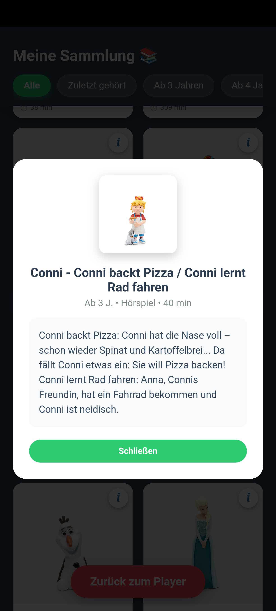
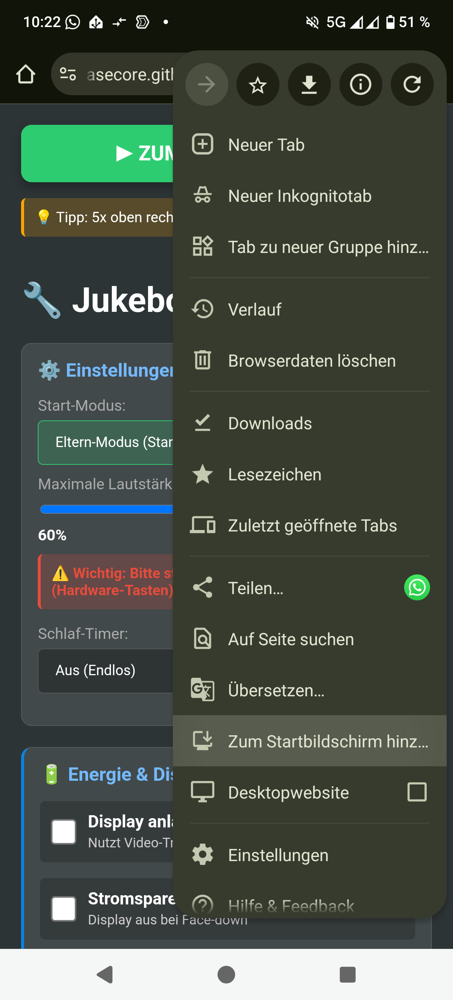
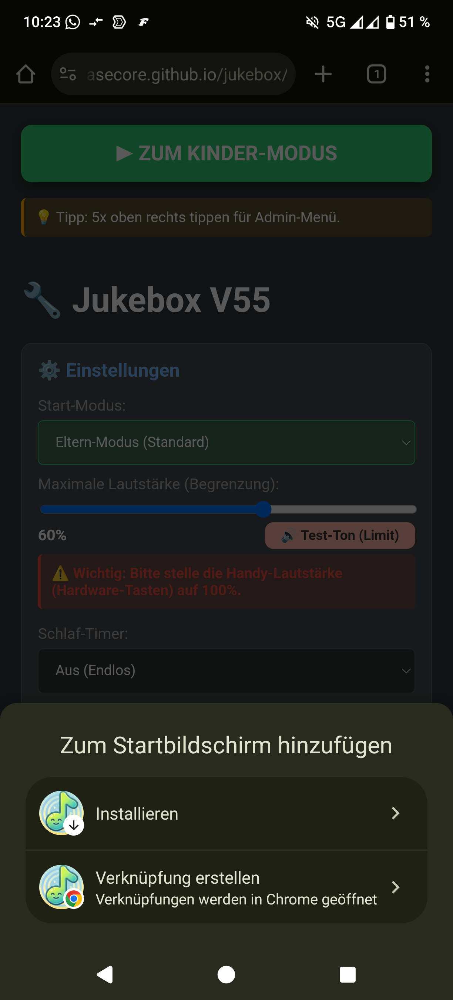
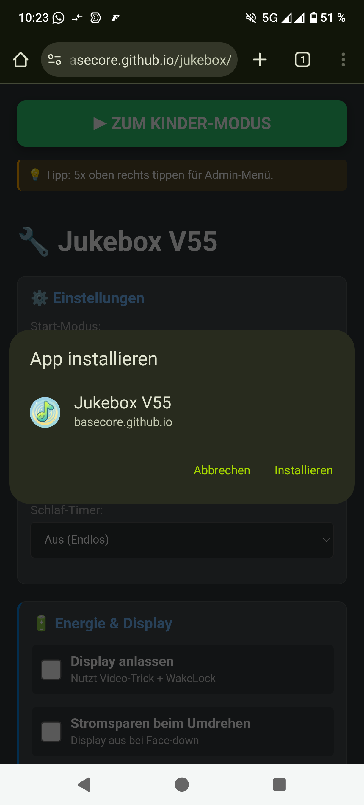
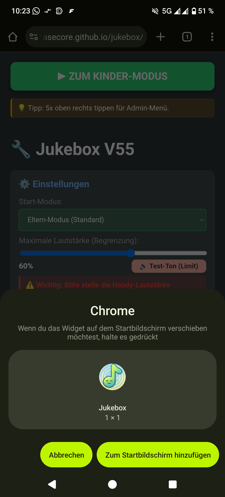

# 🎵 Jukebox PWA (v62 Stats)

**Die smarte DIY "Toniebox" fürs Handy – 100% AI-Generated Code.**

Dieses Projekt ist eine kinderfreundliche Musik-Player-App, die alte Smartphones in sichere, werbefreie Abspielgeräte verwandelt. Sie läuft als **Progressive Web App (PWA)** komplett offline im Browser.

> 🤖 **Made with Gemini:** Dieses gesamte Projekt (HTML, CSS, JavaScript Logik, Datenbank-Struktur) wurde vollständig durch **Google Gemini 3 Pro** erstellt und analysiert. Es ist ein Experiment, wie weit KI-gestützte Entwicklung ohne manuelles Coden gehen kann.

---

## ✨ Neue Funktionen in v62

* 📊 **Detaillierte Eltern-Statistik:** Ein neues Dashboard im Eltern-Modus zeigt genau an:
    * Hördauer (Heute / Woche / Gesamt).
    * Die Top 5 Lieblings-Hörspiele.
    * Tageszeit-Heatmap (Wann wird gehört?).
    * Anzahl der Interaktionen (NFC-Scans, Umdrehen).
* 🛠️ **Bugfixes:**
    * Das seitliche "Wackeln" des Bildschirms im Kinder-Modus wurde behoben.
    * Lange Dateinamen im Editor werden nun korrekt umgebrochen.
* 💾 **Datenbank Upgrade:** Automatische Migration auf DB-Version 2 für das Event-Logging.

---

## 📸 Vorschau

Die App ist in zwei Bereiche unterteilt: Den geschützten **Eltern-Modus** (Verwaltung) und den kindersicheren **Player-Modus**.

### 👶 Kinder-Modus & Bibliothek
Hier spielen die Kinder. Große Bilder, keine Text-Menüs, einfache Bedienung.

| **Der Player (Neu: Rewind)** | **Die Bibliothek** |
|:---:|:---:|
|  |  |
| *Große Steuerung & Cover* | *Visuelles Stöbern & Filtern* |

| **Info-Overlay** | **Details & Dauer** |
|:---:|:---:|
|  |  |
| *Beschreibung & Alter* | *Einfacher Player* |

### 🔧 Eltern-Modus & Statistik
Verwaltung der Inhalte und Einsicht in das Nutzungsverhalten.

| **Verwaltung** | **Statistik (Neu)** |
|:---:|:---:|
|  |  |
| *Tags anlernen & Import* | *Hörverhalten analysieren* |

---

## 📲 Installation & Link

Die App muss nicht über den App-Store geladen werden. Sie ist eine Webseite, die sich wie eine App installiert.

🔗 **Link zur App:** [https://basecore.github.io/jukebox/](https://basecore.github.io/jukebox/)

**So installierst du sie korrekt (Android/Chrome):**
1.  Öffne den Link in **Google Chrome**.
2.  Warte kurz – oft erscheint unten eine Leiste *"Jukebox zum Startbildschirm hinzufügen"*.
3.  Falls nicht: Tippe oben rechts auf das Menü (⋮) und wähle **"App installieren"** oder **"Zum Startbildschirm hinzufügen"**.
4.  Folge den Anweisungen auf dem Bildschirm (siehe Bilder unten).
5.  Starte die App nun direkt vom Homescreen (sie läuft dann im Vollbild ohne Adressleiste).

| **1. Menü öffnen** | **2. Installieren** |
|:---:|:---:|
|  |  |
| *Tippe oben rechts auf die 3 Punkte* | *Wähle "App installieren"* |

| **3. Bestätigen** | **4. Widget platzieren** |
|:---:|:---:|
|  |  |
| *Klicke auf "Installieren"* | *Automatisch oder ziehen* |

*(iOS Nutzer verwenden Safari -> Teilen -> Zum Home-Bildschirm)*

---

## 📖 Bedienung

### 1. Musik hinzufügen
Die App unterstützt zwei Wege:

* **A) Massen-Import (Empfohlen):**
    Erstelle Ordner mit MP3s und Covern am PC und lade sie über "Massen-Import" hoch. **Tipp:** Wenn du unser Python-Tool (siehe unten) nutzt, wird eine `jukebox.json` erstellt. Wähle diese Datei und den Ordner aus – dann sind alle Titel, Cover und Texte sofort perfekt gesetzt!
* **B) Manuell anlernen:**
    Gehe auf "Neuen Tag anlernen", wähle Audio & Bild und fülle im Menü **"📝 Erweiterte Infos"** Details wie Beschreibung und Alter aus.

### 2. NFC Tags nutzen (Optional)
Wenn dein Android-Gerät NFC hat:
1.  Gehe auf "Tag scannen & speichern".
2.  Halte eine NFC-Karte oder Figur an das Handy.
3.  Die Musik ist nun mit diesem Tag verknüpft. Im Kinder-Modus startet sie sofort beim Auflegen.

### 3. Statistik ansehen (Neu in v62)
Klicke im Eltern-Modus oben rechts auf den Button **"📊 Statistik"**. Hier siehst du, was dein Kind wann und wie lange hört.

### 4. Kinder-Modus verlassen
Es gibt keinen sichtbaren "Zurück"-Button, damit Kinder die App nicht versehentlich schließen.
➡️ **Tippe 5x schnell hintereinander in die obere rechte Ecke des Bildschirms, um in den Eltern-Modus zurückzukehren.**

---

## 🪄 Das Python-Tool: TAF zu Jukebox

Hast du **eigene Tonie-Dateien (.taf)**? Du kannst diese mit dem beiliegenden Skript `taf_jukebox_final.py` (im Ordner `tools/`) vollautomatisch für die App konvertieren.

**Das Script erledigt alles:**
1.  Wandelt `.taf` (Tonie-Format) in `.mp3` um (inkl. Kapitelmarken in einer `.cue` Datei).
2.  Lädt das **Original-Cover** herunter.
3.  Holt **Metadaten** (Beschreibungstext, Altersempfehlung, Genre) von der Tonie-Website.
4.  Erstellt eine perfekte `jukebox.json` für den Import.

### Anleitung für PC/Mac:

1.  **Vorbereitung:**
    * Installiere [Python](https://www.python.org/).
    * Installiere [FFmpeg](https://ffmpeg.org/) (muss im System-Pfad sein).
2.  **Dateien ablegen:**
    * Kopiere das Script `taf_jukebox_final.py` und deine `.taf`-Dateien in einen gemeinsamen Ordner.
3.  **Abhängigkeiten installieren:**
    Öffne ein Terminal in dem Ordner und führe aus:
    ```bash
    pip install requests beautifulsoup4 playwright
    playwright install
    ```
4.  **Script starten:**
    ```bash
    python taf_jukebox_final.py
    ```
5.  **Ergebnis:**
    Es entsteht ein Ordner `jukebox_output`. Diesen Ordner kannst du nun direkt über **"📂 Massen-Import"** in die App laden!

---

## 📂 Dateistruktur

* `index.html` - Der gesamte Quellcode der Anwendung (Logik & Design, v62).
* `sw.js` - Der Service Worker für die Offline-Funktionalität (Cache v62).
* `manifest.json` - Konfiguration für das App-Icon und den Vollbild-Modus.
* `assets/` - Ordner für Icons und Test-Sounds.
* `tools/` - Enthält das Python-Script für den Import von Tonie-Dateien.

---

## 🔗 Projekt & Support

* 🏠 **Projekt:** [github.com/basecore/jukebox](https://github.com/basecore/jukebox/)
* 🐛 **Fehler melden:** [Issues & Bugs](https://github.com/basecore/jukebox/issues)

## 👨‍💻 Credits
Entwickelt von Sebastian Rößer mit Unterstützung von **Google Gemini 3 Pro**.
Version 62 "Stats Edition".
